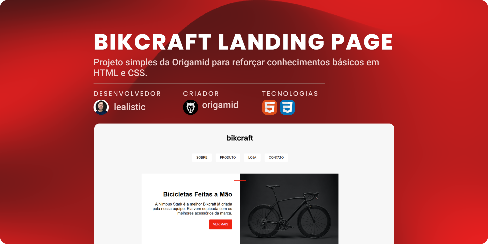

<h1 align="center">Bikcraft Landing Page</h1>

<!--Pontos de Navegação-->

  <a href="#-tecnologias">Tecnologias</a>&nbsp;&nbsp;&nbsp;|&nbsp;&nbsp;&nbsp;
  <a href="#-projeto">Projeto</a>&nbsp;&nbsp;&nbsp;|&nbsp;&nbsp;&nbsp;
  <a href="#memo-licença">Licença</a>

  

 

  

## 🚀 Tecnologias

Esse projeto foi desenvolvido com as seguintes tecnologias:

📌 HTML5
📌 CSS3

## 💻 Projeto

Projeto desenvolvido durante o curso da Origamid, com o objetivo de reforçar conceitos fundamentais de HTML e CSS. A landing page da Bikcraft (marca fictícia) aplica:

✔ HTML Semântico para melhor estruturação;

✔ Layouts com Grid e Flexbox para alinhamento responsivo;

✔ Propriedades CSS customizadas fazendo uso do seletor `:root`;

✔ Media Queries para adaptação a diferentes telas e tema escuro do sistema;

✔ Acessibilidade com atributos como aria-labelledby para leitores de tela.

🔗 [Acesse o projeto finalizado, online](https://lealistic.github.io/origamid-bikcraft/)

## 📝 Licença

Esse projeto está sob a licença MIT.
